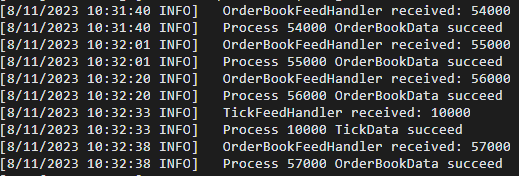

# Niffler

Niffler is a cloud-based vendor-free framework (to switch to any vendor you want) for real-time tick 
level market data, we process and store over 100GB of data per day.

Also, every researcher/trader could leverage the tick-level market data and rebuild the market structure to do the back-test 
for their own trading strategies with the highest accuracy

(It's a demo repo, prod repo is private and under development and the API will be available soon)

## Data Available
- Equity

  - [x] US sp500 Real-time tick data, real-time order book data, and historical K-line data
  - [x] HK Real-time tick data, real-time order book data, and historical K-line data
  - [x] SH Real-time tick data, real-time order book data, and historical K-line data
  - [ ] SG Real-time tick data, real-time order book data, and historical K-line data

- Equity Option
  - [x] US Real-time 30s snapshot data
  - [x] HK Real-time 30s snapshot data

## Example for HK Market Data Sourcing

## Contact
Have questions? Reach out to [the person to blame](https://www.linkedin.com/in/chenwang666/)

