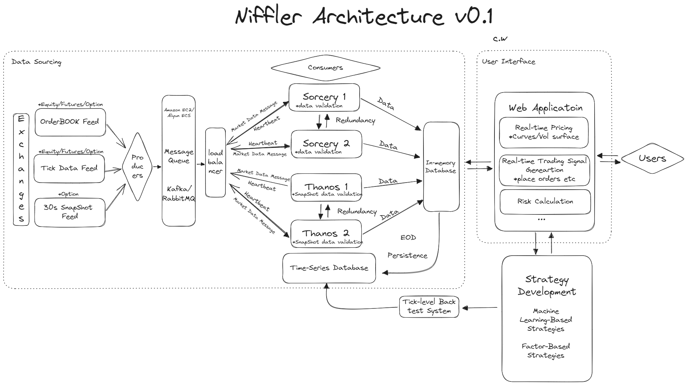

# Niffler Demo Repo

## A Trading Framework for Everyone

Niffler is a cloud-based vendor-free framework (to switch to any vendor you want) for trading using the tick-level data feed
, we process and store over 100GB(30 million+) of data per day.

It could provide signal notification, live curve, volatility surface calibration, and risk calculation

The researcher/trader could leverage its ample market data to rebuild the market structure and back-test
their trading strategies with the highest accuracy. Users could receive the notification via either website or IM app such as WeChat, WhatsApp

(Currently, the Niffler prod repo is private, it is the demo repo, and the application will be available soon)

# Design

# Design (with more details)

Niffler is a cloud-based vendor-free framework (to switch to any vendor you want) for trading using the tick-level data feed
, we process and store over 100GB of data per day.

It could provide signal breakthrough notification, live curve, volatility surface calibration, and risk calculation

The researcher/trader could leverage its ample market data to rebuild the market structure and back-test
their trading strategies with the highest accuracy

(Currently, the Niffler prod repo is private, it is the demo repo, and the application will be available soon)

# Data Available
- Equity

  - [x] US sp500 Real-time tick data, real-time order book data, and historical K-line data
  - [x] HK Real-time tick data, real-time order book data, and historical K-line data
  - [x] SH Real-time tick data, real-time order book data, and historical K-line data
  - [ ] SG Real-time tick data, real-time order book data, and historical K-line data

- Equity Option
  - [x] US Real-time 30s snapshot data
  - [x] HK Real-time 30s snapshot data

- Futures
  - [x] US Futures

# Example for US Market Data Sourcing

# Contact
Have questions? Reach out to [the person to blame](https://www.linkedin.com/in/chenwang666/)

