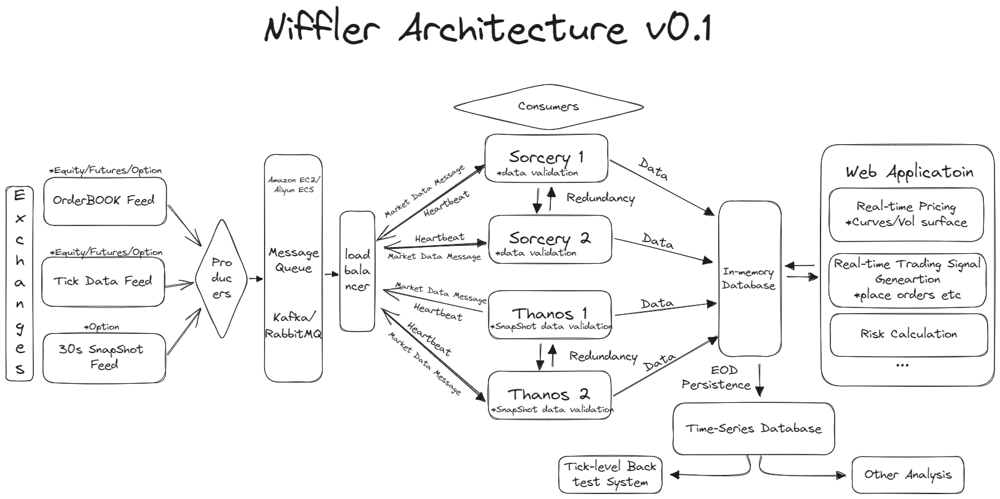
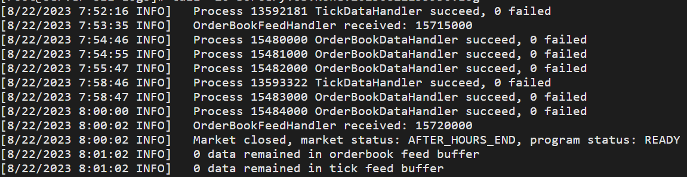

# Niffler

## A trading framework for everyone

# Design

Niffler is a cloud-based vendor-free framework (to switch to any vendor you want) for trading using tick-level data feed
, we process and store over 100GB of data per day.

It could provide sigal breakthrough notification, live curve and volatility surface calibration and risk calculation

Researcher/trader could leverage its ample market data to rebuild the market structure and back-test
their trading strategies with the highest accuracy

(Currently prod repo is private and the application will be available soon)

# Data Available
- Equity

  - [x] US sp500 Real-time tick data, real-time order book data, and historical K-line data
  - [x] HK Real-time tick data, real-time order book data, and historical K-line data
  - [x] SH Real-time tick data, real-time order book data, and historical K-line data
  - [ ] SG Real-time tick data, real-time order book data, and historical K-line data

- Equity Option
  - [x] US Real-time 30s snapshot data
  - [x] HK Real-time 30s snapshot data

# Example for US Market Data Sourcing

# Contact
Have questions? Reach out to [the person to blame](https://www.linkedin.com/in/chenwang666/)

