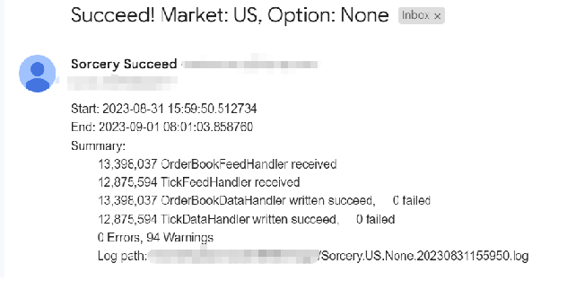

## A Trading Framework for Everyone

Trade Copilot is a cloud-based machine-learning powered framework for back-testing and real-time trading
leverage the tick-level data feed, we process and store over 100GB(30 million+) of data per day.

Trade Copilot could provide signal notification, live curve, volatility surface calibration, and real-time risk calculation

Researchers and traders could leverage its ample market data to rebuild the market structure and back-test
their trading strategies with the highest accuracy. They could receive the notification via either a website or IM app such as WeChat, WhatsApp

(Currently, the Trade Copilot prod repo is private, it is the demo repo, and the application will be available soon)

# Design

# Design (simplified)

# Data Available
- Equity

  - [x] US sp500 Real-time tick data, real-time order book data, and historical K-line data
  - [x] HK Real-time tick data, real-time order book data, and historical K-line data
  - [x] SH Real-time tick data, real-time order book data, and historical K-line data
  - [ ] SG Real-time tick data, real-time order book data, and historical K-line data

- Equity Option
  - [x] US Real-time 30s snapshot data
  - [x] HK Real-time 30s snapshot data

- Futures
  - [x] US Futures

# Example for US Market Data Sourcing

### Handling US market data

### Email Notification

### MD5 Check for EOD data persistence

# Contact
Have questions or suggestions? Reach out to [me](https://www.linkedin.com/in/chenwang666/)

